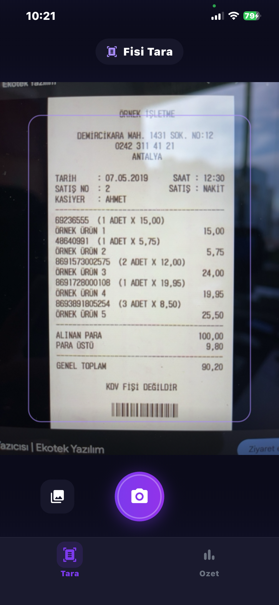
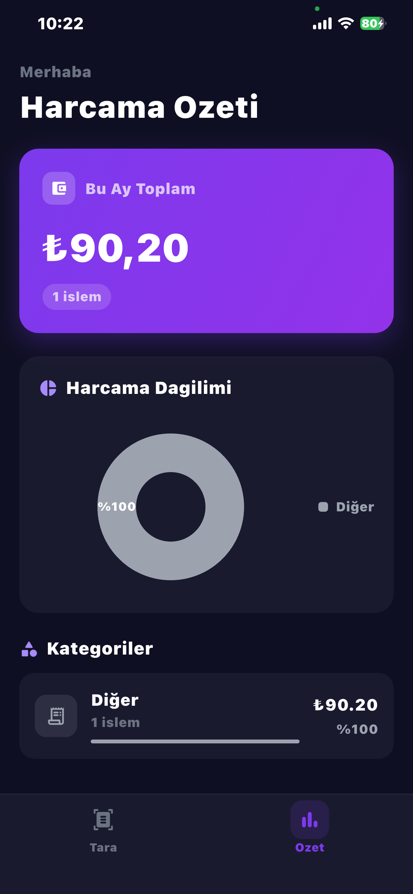
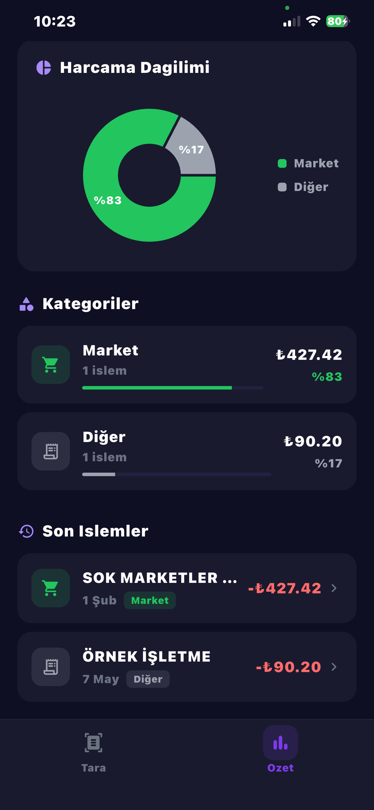

<div align="center">

# 🧾 ReceiptSnap

**Yapay zeka destekli fiş tarama ve harcama takip uygulaması**

[](https://flutter.dev)
[](https://dart.dev)
[](https://ai.google.dev)
[](LICENSE)

*Fişlerinizi kameraya gösterin, gerisini Gemini AI halletsin!*

</div>

---

## 📱 Ekran Görüntüleri

<div align="center">
<table>
  <tr>
    <td align="center"><b>📸 Fiş Tarama</b></td>
    <td align="center"><b>🤖 AI Analiz</b></td>
    <td align="center"><b>📊 Harcama Özeti</b></td>
    <td align="center"><b>📂 Kategori Detayları</b></td>
  </tr>
  <tr>
    <td></td>
    <td></td>
    <td></td>
    <td></td>
  </tr>
  <tr>
    <td align="center"><sub>Kamera ile fiş tarama</sub></td>
    <td align="center"><sub>Gemini AI işliyor</sub></td>
    <td align="center"><sub>Aylık harcama özeti</sub></td>
    <td align="center"><sub>Kategori ve işlem listesi</sub></td>
  </tr>
</table>
</div>

---

## ✨ Özellikler

| Özellik | Açıklama |
|---------|----------|
| 📸 **Fiş Tarama** | Kamera ile anlık fiş çekme veya galeriden görsel seçme |
| 🤖 **Gemini AI Analizi** | Google Gemini 2.5 Flash ile otomatik bilgi çıkarma (mağaza, tutar, tarih, kategori) |
| 📊 **Harcama Özeti** | Aylık toplam harcama ve pasta grafiği ile dağılım |
| 🏷️ **Otomatik Kategorizasyon** | 6 kategoriye otomatik sınıflandırma |
| 📱 **Modern Dark UI** | Mor aksan renkli premium koyu tema |
| 💾 **Yerel Depolama** | Hive ile güvenli cihaz içi veri saklama |

### 🏷️ Desteklenen Kategoriler

| Kategori | Açıklama | Örnekler |
|----------|----------|----------|
| 🍽️ Yemek | Restoran, kafe, fast food | Starbucks, McDonald's, lokanta |
| 🛒 Market | Süpermarket, gıda alışverişi | Migros, BİM, A101, ŞOK |
| 🚗 Ulaşım | Taksi, benzin, toplu taşıma | Uber, OPET, Shell |
| 🏢 Ofis | Kırtasiye, ofis malzemesi | Kırtasiye, mobilya |
| 💻 Yazılım | Dijital abonelik, hosting | GitHub, AWS, Adobe |
| � Diğer | Diğer harcamalar | — |

---

## 🏗️ Proje Mimarisi

```
lib/
├── main.dart                    # Uygulama giriş noktası
├── app.dart                     # Ana widget ve navigasyon
│
├── core/
│   ├── constants.dart           # Kategori tanımları, renkler, ikonlar
│   └── theme.dart               # Dark tema yapılandırması
│
├── models/
│   ├── receipt.dart             # Fiş veri modeli (Hive)
│   └── receipt.g.dart           # Hive TypeAdapter (auto-generated)
│
├── providers/
│   ├── receipts_provider.dart   # Fiş state yönetimi (Riverpod)
│   └── dashboard_providers.dart # Dashboard hesaplamaları
│
├── screens/
│   ├── camera_screen.dart       # Kamera / tarama ekranı
│   └── dashboard_screen.dart    # Harcama özeti ekranı
│
├── services/
│   ├── gemini_service.dart      # Gemini AI entegrasyonu
│   └── hive_service.dart        # Yerel veritabanı servisi
│
└── widgets/
    ├── total_card.dart          # Toplam harcama kartı
    ├── expense_pie_chart.dart   # Pasta grafiği
    ├── category_card.dart       # Kategori kartı
    └── receipt_tile.dart        # İşlem satırı
```

---

## 🛠️ Teknoloji Yığını

| Teknoloji | Kullanım |
|-----------|----------|
| [Flutter](https://flutter.dev) 3.10+ | Cross-platform mobil geliştirme |
| [Riverpod](https://riverpod.dev) | Reactive state management |
| [Hive](https://docs.hivedb.dev) | Yerel NoSQL veritabanı |
| [Google Generative AI](https://ai.google.dev) | Gemini 2.5 Flash — fiş analizi |
| [Camera](https://pub.dev/packages/camera) | Kamera erişimi |
| [Image Picker](https://pub.dev/packages/image_picker) | Galeriden görsel seçme |
| [fl_chart](https://pub.dev/packages/fl_chart) | Pasta grafiği |
| [intl](https://pub.dev/packages/intl) | Türkçe tarih/sayı formatları |

---

## 🚀 Kurulum

### Ön Gereksinimler

- Flutter SDK `>= 3.10.7`
- Dart SDK `>= 3.10.7`
- Android Studio / Xcode
- [Google AI Studio](https://aistudio.google.com/) üzerinden **Gemini API Key**

### Adımlar

```bash
# 1. Depoyu klonlayın
git clone https://github.com/dincerkizilderee/receiptsnap.git
cd receiptsnap

# 2. Bağımlılıkları yükleyin
flutter pub get

# 3. Hive TypeAdapter'larını üretin
dart run build_runner build --delete-conflicting-outputs

# 4. Uygulamayı çalıştırın
flutter run
```

> ⚠️ **API Key Ayarı:** `lib/services/gemini_service.dart` dosyasındaki `_apiKey` değerini kendi Gemini API anahtarınızla değiştirin.

---

## 📖 Kullanım

1. **Tara** sekmesinde kamerayı fişe doğrultun
2. 📸 butonuyla fotoğraf çekin veya 🖼️ ile galeriden seçin
3. **Gemini AI** otomatik analiz eder — mağaza, tutar, tarih, kategori çıkarılır
4. **Özet** sekmesinden harcama dağılımınızı görüntüleyin
5. İşlem satırını sola kaydırarak silebilirsiniz

---

## 🤝 Katkıda Bulunma

1. Bu depoyu **fork** edin
2. Yeni branch: `git checkout -b feature/yeni-ozellik`
3. Commit: `git commit -m 'Yeni özellik eklendi'`
4. Push: `git push origin feature/yeni-ozellik`
5. **Pull Request** oluşturun

---

## 📄 Lisans

Bu proje [MIT Lisansı](LICENSE) ile lisanslanmıştır.

---

<div align="center">

**ReceiptSnap** ile harcamalarınızı akıllıca takip edin 💜

*Made with ❤️ and Flutter*

</div>
